# 智能导购 LangGraph Tool Loop 技术方案

制定日期：2026-07-01

> 注意：本文是早期详细技术草案，包含“四个 Tool + finish_guide”的设计。当前方案已收敛为“单 Agent + 单 `query_products` Tool + 极简 State”，实现时以 `智能导购LangGraph精简方案.md` 为准。

## 1. 文档说明

| 项目 | 内容 |
|---|---|
| 文档状态 | Proposed，供智能导购 AI 编排重构评审 |
| 方案目标 | 在不改变现有业务接口和商品推荐规则的前提下，将 AI 编排改造成 LangGraph 单 Agent Tool Loop |
| 需求来源 | `docs/智能导购小程序需求文档.md` |
| 现状参考 | `docs/智能导购小程序技术方案.md`、`backend/bff/src/ai/*`、`backend/bff/src/conversations/*` |
| 方法参考 | 桌面 `agent-tool-loop-guide.md` 中的 Agent、Context、Tool Loop 设计原则 |
| 官方参考 | LangGraph TypeScript 的 `StateGraph`、`MessagesValue`、Tool Calling、`ToolNode` 和条件边 |
| 部署约束 | AI 继续内嵌在 `backend/bff`，不重新拆成独立微服务 |
| 对外兼容 | 小程序接口仍返回 `{ messageId, reply, products }`，前端无需感知 LangGraph |

---

## 2. 方案摘要

本方案采用一个单体 `Guide Agent`，通过以下循环完成导购回复：

```text
用户输入
  → LLM 判断下一步
  → 调用只读 Tool 获取真实商品信息
  → Tool 结果回填上下文
  → LLM 基于反馈继续决策
  → 调用 finish_guide 提交最终答复
  → 代码校验事实、商品 ID、卡片数量和顺序
  → 输出 reply + products
```

核心决策：

| 决策项 | 采用方案 | 说明 |
|---|---|---|
| Agent 数量 | 单 Agent | 当前工具数量少、领域单一，不引入多 Agent |
| 编排模式 | Agent Tool Loop | LLM 动态选择工具，不用大量固定 Router 分支拼接业务流程 |
| 图 API | LangGraph `StateGraph` | 显式管理状态、节点、条件边、循环和终止 |
| 工具数量 | 4 个核心工具 | 搜索商品、读取商品详情、查询品类、提交最终回复 |
| 最终输出 | 显式 `finish_guide` Tool | 不接受模型直接输出任意文本作为最终结果 |
| 业务状态 | `GuideState` 独立维护 | 不依赖 LLM 从历史消息中“记住”商品 ID 和业务阶段 |
| 持久化 | 继续使用 BFF 会话表 | 一期不启用 LangGraph Checkpointer，避免形成双状态源 |
| 商品卡片 | BFF 从数据库组装 | 模型只能返回商品 ID，不能生成价格、图片、跳转地址 |
| 可观测 | Langfuse | 跟踪每次 LLM、Tool、校验与降级 |
| 自动评测 | Promptfoo | 固化真实对话场景，防止改 Prompt 或模型后回归 |

---

## 3. 背景与问题

### 3.1 当前链路

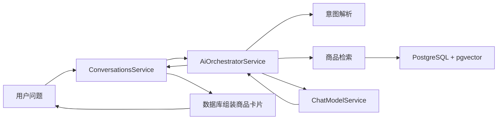

### 3.2 已暴露的问题

| 编号 | 问题 | 真实表现 | 主要原因 |
|---|---|---|---|
| P-1 | 当前商品追问被当成新检索 | “有优惠吗”返回“没有找到商品” | 意图判断依赖不断增长的正则和分支 |
| P-2 | 商品追问重复卡片 | “这个适合几个人吃”再次发送同一商品卡片 | 回复生成和卡片决策没有统一出口 |
| P-3 | 文字顺序与卡片顺序不同 | 文字中的第一款和第一张卡片不是同一商品 | 商品 ID 顺序缺少最终一致性校验 |
| P-4 | 不存在的信息可能被编造 | 商品资料未写适用人数，模型仍按常识回答 | 缺少 Tool Evidence 和字段能力声明 |
| P-5 | 编排代码持续膨胀 | 每增加一种说法就增加规则和特殊分支 | Agent 决策、业务状态和安全校验混在一个 Service |
| P-6 | 修改后难证明整体变好 | 单场景修复后可能破坏其他场景 | 缺少固定评测集与节点级追踪 |

### 3.3 为什么采用 Tool Loop

Tool Loop 的价值不是让模型拥有更多自由，而是建立以下约束：

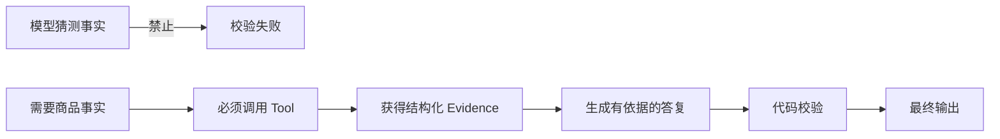

模型负责：

- 判断用户是在推荐商品、追问当前商品、换一款、咨询品类还是闲聊；
- 决定调用哪个只读工具；
- 根据工具反馈组织自然语言；
- 通过 `finish_guide` 提交结构化最终答复。

代码负责：

- 鉴权、商家隔离、参数校验和幂等；
- Tool 的真实执行；
- 商品事实和能力字段；
- 商品 ID 白名单、数量、顺序和卡片规则；
- 循环上限、超时、错误反馈与降级。

---

## 4. 设计目标与非目标

### 4.1 设计目标

| 优先级 | 目标 | 验证方式 |
|---|---|---|
| P0 | 商品事实必须来自 Tool 返回结果 | 无 Tool Evidence 时不得输出价格、规格、库存、优惠等事实 |
| P0 | 所有商品查询强制限定当前商家 | 跨商家商品 ID 和搜索结果测试 |
| P0 | 当前商品追问不得重新推荐或重复商品卡片 | “有优惠吗”“几个人吃”“多少钱”多轮测试 |
| P0 | 推荐文字、`productIds` 和商品卡片顺序一致 | 顺序断言与真实接口回归 |
| P0 | 保持现有接口、消息持久化和幂等逻辑不变 | BFF 集成测试 |
| P0 | Tool Loop 有明确终止条件 | 最大轮次、总超时和 fallback 测试 |
| P1 | 新增场景主要通过 Tool 描述、Prompt 和评测集扩展 | 不再为每种自然语言说法增加 Service 分支 |
| P1 | 可以追踪每一步模型和 Tool 决策 | Langfuse Trace 检查 |
| P1 | 模型或 Prompt 变更可以自动回归 | Promptfoo 场景评测 |

### 4.2 非目标

本期不做：

- 多 Agent、Supervisor Agent 或子 Agent；
- 订单、支付、配送、售后、退款等交易工具；
- 实时库存和实时优惠接入；
- 让模型生成商品卡片完整数据；
- 改造小程序消息协议；
- 将 AI 再拆分成独立服务；
- 使用 LangGraph 代替当前消息表、会话表和幂等状态；
- 开放写操作 Tool。

---

## 5. 总体架构

### 5.1 参考图对应关系

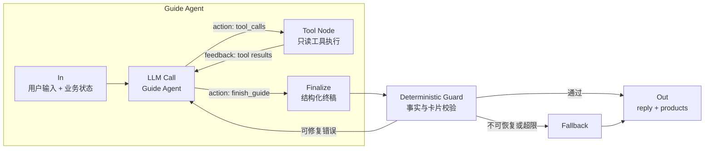

与参考图一致：

| 参考图元素 | 本方案实现 |
|---|---|
| In | 用户问题、商家信息、最近消息、最近商品卡片 |
| LLM call | `guide_agent` 节点 |
| action | 模型输出的 Tool Calls |
| Tool | LangGraph `ToolNode` 或等价自定义 Tool 执行节点 |
| feedback | `ToolMessage` 回填 `messages` |
| loop | `tools → guide_agent` 条件循环 |
| Out | `finish_guide → validate_finish → reply + products` |

### 5.2 系统边界

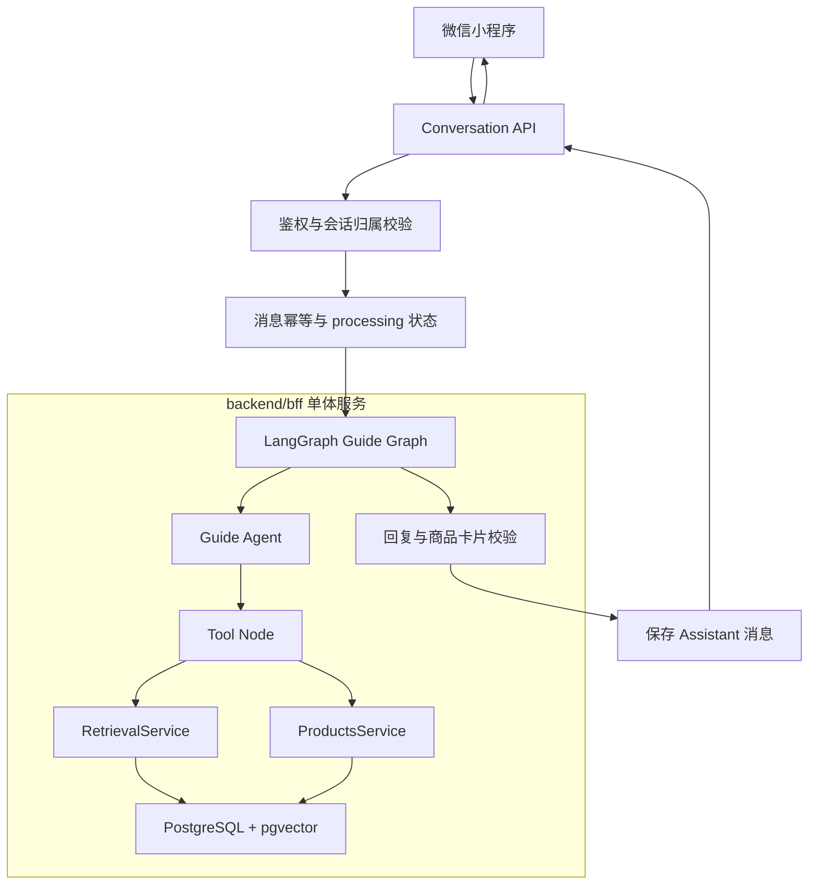

### 5.3 部署结论

```text
微信小程序
    ↓
backend/bff
  ├─ Auth
  ├─ Merchants
  ├─ Products
  ├─ Conversations
  └─ AI / LangGraph
    ↓
PostgreSQL + pgvector
    ↓
外部 Chat Model / Embedding Model
```

LangGraph 是 BFF 内部依赖，不增加一个新的业务服务。

---

## 6. LangGraph 主图

### 6.1 Guide Graph

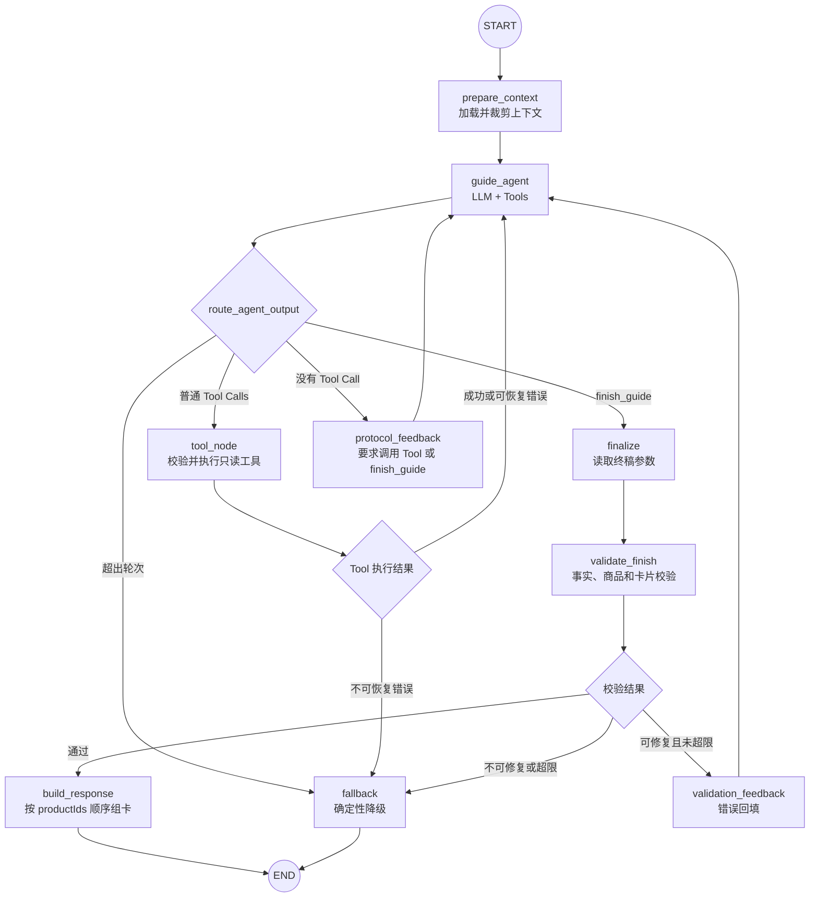

### 6.2 为什么不再设置大型 Router

原方案采用固定路由：

```text
router → contact/chitchat/context/product → 各分支
```

本方案改为：

```text
prepare_context → guide_agent ↔ tools → finish_guide
```

原因：

| 项目 | 固定 Router | Tool Loop |
|---|---|---|
| 新自然语言表达 | 经常需要新增规则 | 模型结合 Tool 描述判断 |
| 多轮上下文 | 容易先分错路由 | Agent 可以先读状态，再决定 Tool |
| 商品事实 | 分支内可能绕过检索 | Prompt 强制需要 Evidence 时调用 Tool |
| 可解释性 | 只能看到最终分支 | 可以看到每次 Tool Call 和反馈 |
| 安全边界 | 分散在多个分支 | 最终统一经过 `validate_finish` |

保留的确定性逻辑仅包括：

- 会话和商家权限校验；
- 最近商品卡片顺序提取；
- 序数引用的基础解析；
- Tool 参数与结果校验；
- 最终回复与卡片校验；
- 超时和降级。

---

## 7. Tool Loop 运行规则

### 7.1 单轮循环

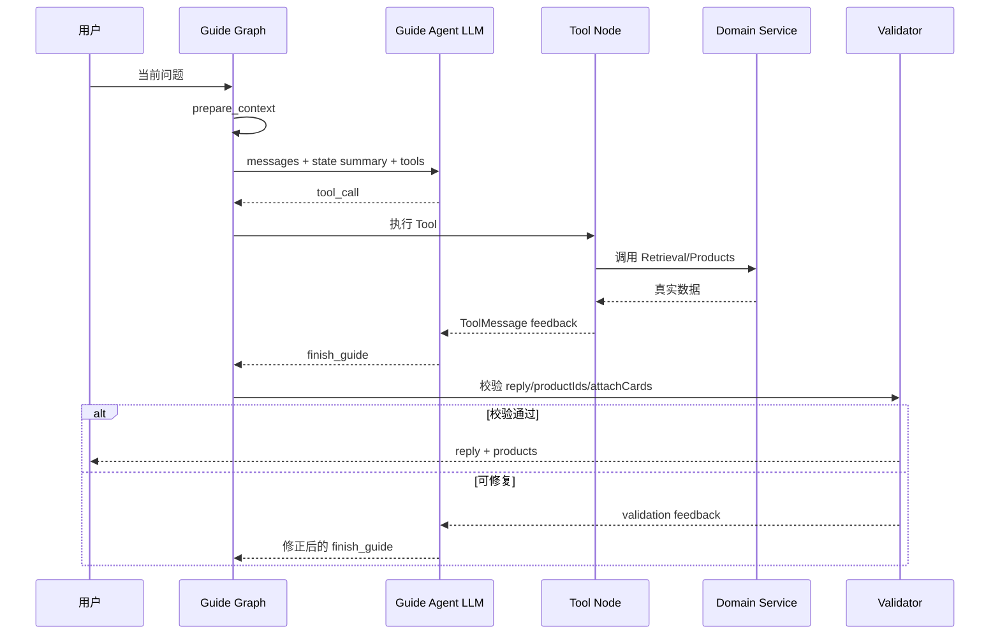

### 7.2 循环停止条件

| 条件 | 处理 |
|---|---|
| 模型调用 `finish_guide` 且校验通过 | 正常结束 |
| 达到 `MAX_TOOL_ROUNDS` | 进入确定性 fallback |
| 达到 LangGraph `recursionLimit` | 捕获异常并进入 fallback |
| 达到单请求总超时 | 标记消息失败，返回现有服务错误 |
| Tool 返回不可恢复错误 | 进入 fallback |
| 连续两次提交相同非法参数 | 进入 fallback，防止死循环 |
| 模型直接输出文本但无 Tool Call | 回填协议错误，允许修正一次 |

建议初始配置：

| 配置 | 建议值 | 说明 |
|---|---:|---|
| `MAX_TOOL_ROUNDS` | 4 | 导购场景不应需要长链推理 |
| `recursionLimit` | 12 | 覆盖 Agent、Tool、校验反馈等图步数 |
| 单次 Tool 超时 | 2 秒 | 数据库只读 Tool |
| 单次 LLM 超时 | 20 秒 | 与现有对话模型配置保持一致 |
| 单请求总超时 | 25 秒 | 防止 Tool Loop 长时间占用请求 |
| Tool 返回商品数 | 最多 5 | 与产品卡片上限一致 |
| Tool 结果大小 | 待确认，建议不超过 8 KB | 防止上下文膨胀 |

### 7.3 Tool 错误反馈

Tool 异常不能直接作为模型最终答复，而应转成统一反馈：

```typescript
interface ToolResult<T> {
  ok: boolean;
  data?: T;
  error?: {
    code: string;
    message: string;
    retryable: boolean;
  };
  evidenceId: string;
}
```

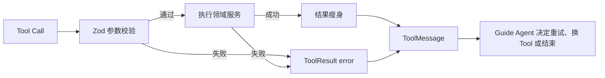

---

## 8. State 设计

### 8.1 State 与 Messages 分离

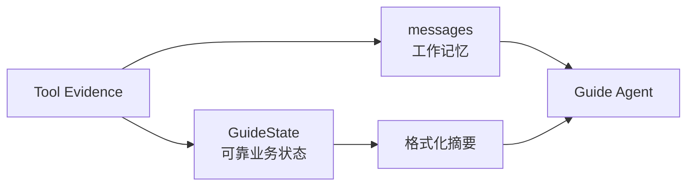

原则：

- `messages` 保存 LLM、Tool Call、Tool Result 的协议上下文；
- `GuideState` 保存商家、当前商品、证据、循环次数等可靠业务状态；
- 商品 ID、商家 ID、卡片顺序不能只存在自然语言里；
- Tool Call 和对应 Tool Result 必须成对追加；
- Tool 原始数据库行不得直接写入上下文。

### 8.2 GuideState

```typescript
interface GuideState {
  // 输入
  requestId: string;
  conversationId: string;
  userId: string;
  merchant: {
    id: string;
    name: string;
    industry: string;
    phone: string | null;
    description: string | null;
  };
  question: string;

  // LLM 工作上下文
  messages: BaseMessage[];
  historySummary: string | null;
  recentProducts: Array<{
    id: string;
    name: string;
    displayOrder: number;
  }>;

  // 当前商品引用
  focusedProductIds: string[];
  referenceStatus: "none" | "resolved" | "ambiguous";

  // Tool Evidence
  evidence: Record<string, GuideEvidence>;
  availableProductIds: string[];
  lastSearchProductIds: string[];

  // 输出草稿
  finishDraft: {
    reply: string;
    productIds: string[];
    attachCards: boolean;
    evidenceIds: string[];
  } | null;

  // 最终输出
  finalReply: string;
  finalProductIds: string[];
  finalProducts: RetrievedProduct[];

  // 控制
  toolRounds: number;
  validationRounds: number;
  lastErrorCode: string | null;
  trace: Array<{
    node: string;
    durationMs: number;
    status: "ok" | "error";
  }>;
}
```

### 8.3 Evidence

```typescript
interface GuideEvidence {
  id: string;
  toolName: string;
  merchantId: string;
  productIds: string[];
  facts: Record<string, unknown>;
  knownFields: string[];
  unknownFields: string[];
  createdAt: string;
}
```

Evidence 的作用：

| 能力 | 说明 |
|---|---|
| 防编造 | 最终事实必须能映射到某个 `evidenceId` |
| 卡片白名单 | `productIds` 必须来自本轮 Evidence |
| 能力声明 | Tool 明确返回 `knownFields/unknownFields` |
| 可观测 | Langfuse 可以记录 Tool 和 Evidence 的关系 |
| 回归测试 | 可以断言“优惠未接入时必须是 unknown” |

---

## 9. Tool 设计

### 9.1 Tool 总览

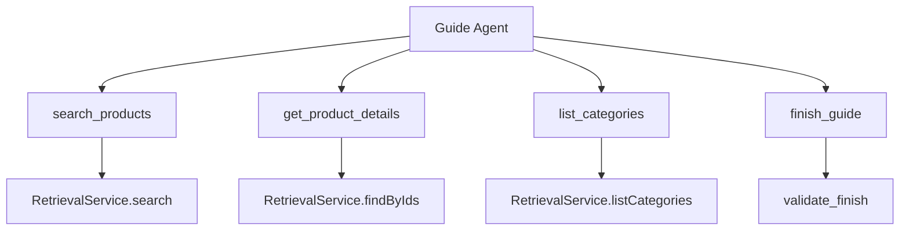

只提供 4 个核心 Tool，避免工具过多导致模型选错。

### 9.2 `search_products`

**用途**：用户请求推荐、带条件查询、换商品、查看更多商品时使用。

```typescript
const SearchProductsInput = z.object({
  queryText: z.string().min(1),
  keywords: z.array(z.string()).max(8).default([]),
  priceMin: z.number().nonnegative().nullable(),
  priceMax: z.number().nonnegative().nullable(),
  requestedCount: z.number().int().min(1).max(5).default(3),
  excludeProductIds: z.array(z.string().uuid()).max(10).default([]),
});
```

模型不能传入：

- `merchantId`；
- `userId`；
- 商品状态；
- SQL；
- 向量；
- 排序表达式。

这些参数由 Tool Runtime 从 `GuideState` 注入并由代码控制。

返回示例：

```json
{
  "ok": true,
  "evidenceId": "ev_search_01",
  "data": {
    "products": [
      {
        "productId": "uuid",
        "name": "伯爵红茶奶油蛋糕",
        "category": "蛋糕",
        "minPrice": 128,
        "maxPrice": 378,
        "priceOptions": [
          { "label": "4寸", "price": 128 }
        ]
      }
    ],
    "matchedCount": 1
  }
}
```

规则：

| 规则 | 要求 |
|---|---|
| 商家过滤 | 强制使用 `state.merchant.id` |
| 商品状态 | 仅 `on_sale` |
| 最大返回 | 5 款 |
| 排除当前商品 | “换一个”“还有吗”使用 `excludeProductIds` |
| 价格 | 结构化过滤，不交给模型自行判断 |
| 返回字段 | 仅返回模型决策需要的字段 |

### 9.3 `get_product_details`

**用途**：追问“这个多少钱”“第二款有什么尺寸”“有优惠吗”“适合几个人吃”。

```typescript
const GetProductDetailsInput = z.object({
  productIds: z.array(z.string().uuid()).min(1).max(5),
  requestedFields: z.array(
    z.enum([
      "price",
      "specs",
      "description",
      "tags",
      "promotion",
      "inventory",
      "servingCount",
    ]),
  ).min(1),
});
```

执行约束：

- `productIds` 必须属于最近商品卡片或本轮搜索结果；
- 必须属于当前商家；
- 必须仍为上架状态；
- 不存在的实时能力不能通过常识补全。

返回示例：

```json
{
  "ok": true,
  "evidenceId": "ev_detail_02",
  "data": {
    "products": [
      {
        "productId": "uuid",
        "name": "复古裱花kitty",
        "prices": [
          { "label": "5寸", "price": 268 },
          { "label": "6寸", "price": 338 }
        ],
        "knownFields": ["price", "specs"],
        "unknownFields": ["promotion", "inventory", "servingCount"]
      }
    ]
  }
}
```

### 9.4 `list_categories`

**用途**：用户询问店铺有什么类型、口味或品类，但尚未要求具体推荐。

```typescript
const ListCategoriesInput = z.object({});
```

返回内容只包含：

- 当前商家在售品类；
- 商品总数；
- 可选的高频标签，是否返回待确认。

不返回完整商品列表。

### 9.5 `finish_guide`

**用途**：Agent 提交最终结构化回复，是唯一正常结束方式。

```typescript
const FinishGuideInput = z.object({
  reply: z.string().min(1).max(1200),
  productIds: z.array(z.string().uuid()).max(5),
  attachCards: z.boolean(),
  evidenceIds: z.array(z.string()).max(8),
});
```

协议要求：

| 场景 | `attachCards` | `productIds` |
|---|---:|---|
| 新商品推荐 | `true` | 1 到 5 个 |
| 换一款、还有吗 | `true` | 新推荐商品 |
| 当前商品价格/规格追问 | `false` | 可为空，推荐为空 |
| 优惠/库存等未接入事实 | `false` | 空 |
| 电话、闲聊 | `false` | 空 |
| 无匹配结果 | `false` | 空 |
| 需要用户明确“第几款” | `false` | 空 |

---

## 10. 节点清单

| 节点 | 类型 | 输入 | 输出 | 职责 |
|---|---|---|---|---|
| `prepare_context` | 代码节点 | Graph 输入 | 初始 State + Messages | 裁剪历史、解析最近商品顺序、注入商家事实 |
| `guide_agent` | LLM 节点 | Messages + State 摘要 + Tools | AIMessage + Tool Calls | 决定调用工具或提交最终答复 |
| `route_agent_output` | 条件边 | 最后一条 AIMessage | tools/finalize/repair/fallback | 协议路由 |
| `tool_node` | Tool 节点 | Tool Calls | ToolMessages + Evidence | 校验、执行、瘦身、记录 Tool 结果 |
| `protocol_feedback` | 代码节点 | 非法 Agent 输出 | System/Tool Feedback | 要求模型改为 Tool Call |
| `finalize` | 代码节点 | `finish_guide` 参数 | `finishDraft` | 不直接信任模型参数，只保存草稿 |
| `validate_finish` | 代码节点 | Draft + Evidence + State | pass/repair/fallback | 统一事实与商品卡片校验 |
| `validation_feedback` | 代码节点 | 校验错误 | Feedback Message | 告诉模型具体违反了哪条规则 |
| `build_response` | 代码节点 | 已验证 productIds | reply + products | 按 ID 顺序从数据库结果组装卡片 |
| `fallback` | 代码节点 | 错误和已有 Evidence | 确定性回复 | LLM/Tool/循环失败时降级 |

---

## 11. Agent Prompt 设计

### 11.1 Prompt 分层

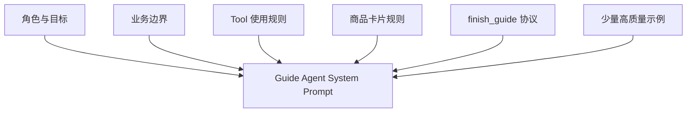

### 11.2 System Prompt 骨架

```text
1. 角色与目标
你是当前商家的智能导购，只帮助用户理解和选择当前商家的商品。

2. 能力边界
- 只推荐当前商家 Tool 返回的真实商品。
- 不承诺库存、优惠、配送、原料、保质期等未接入数据。
- 不承接下单、支付、售后。

3. Tool 使用规则
- 任何商品事实都必须来自本轮 Tool Evidence。
- 新推荐、换商品、查看更多商品时调用 search_products。
- 当前商品追问优先调用 get_product_details，禁止重新搜索同一商品。
- 店铺品类问题调用 list_categories。
- 不允许猜测 Tool 参数；商品引用不明确时要求用户说明第几款。

4. 卡片规则
- 只有 recommendation 场景允许 attachCards=true。
- 当前商品详情追问不得重复发送旧卡片。
- productIds 顺序必须与回复中商品出现顺序一致。
- 用户明确要求一款或两款时严格遵守数量。

5. 输出规则
- 必须通过 finish_guide 提交最终结果。
- 不得直接输出最终文本。
- finish_guide 必须作为该轮唯一的 Tool Call，不能与查询 Tool 同轮提交。
- 没有明确事实时使用 unsupported_fact，不要编造。
```

### 11.3 Prompt 中注入的业务状态

只注入必要摘要：

```text
当前商家：吾安蛋糕店
行业：蛋糕
客服电话：<merchant.phone>

上一轮展示商品：
1. 复古裱花kitty（productId=...）

当前已解析引用：
- focusedProductIds: [...]
- referenceStatus: resolved

当前可用 Evidence：
- ev_detail_02: known=[price,specs], unknown=[promotion,inventory,servingCount]
```

不注入：

- JWT；
- OpenID；
- 数据库连接信息；
- 商品完整原始 JSON；
- 图片列表；
- 小程序跳转参数；
- 与当前问题无关的历史 Tool 结果。

---

## 12. 关键场景图

### 12.1 推荐两款商品

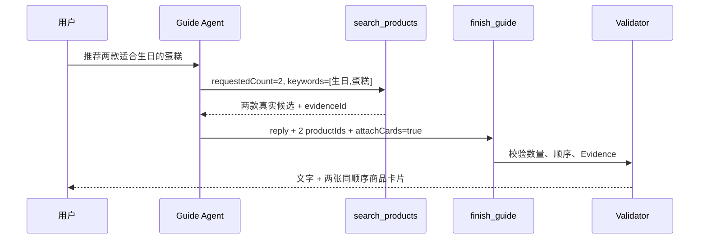

验收规则：

- 商品数量必须为 2；
- 回复中第一款必须对应第一张卡片；
- 不得出现候选集合外商品；
- 卡片数据由 BFF 从数据库组装。

### 12.2 当前商品优惠追问

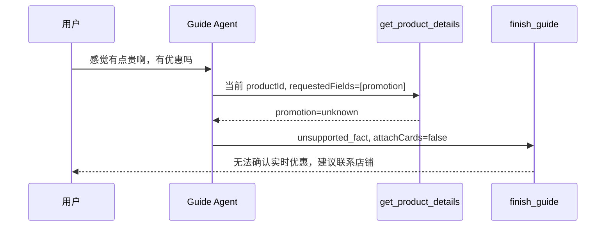

禁止行为：

- 不调用 `search_products`；
- 不回复“没有找到符合要求的蛋糕”；
- 不重复发送当前商品卡片；
- 不编造折扣、满减或优惠券。

### 12.3 当前商品适用人数追问

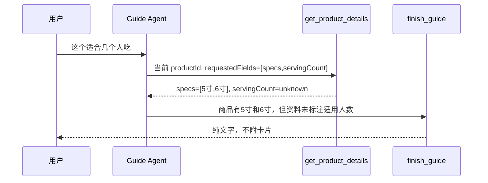

### 12.4 “还有吗”换推荐

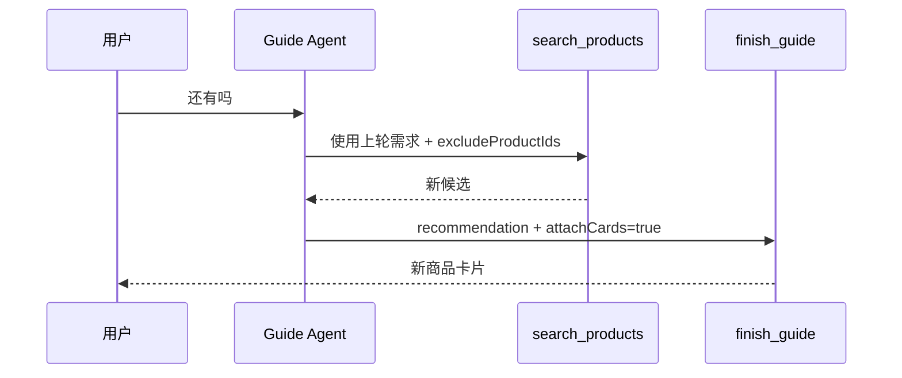

### 12.5 “第二款”引用

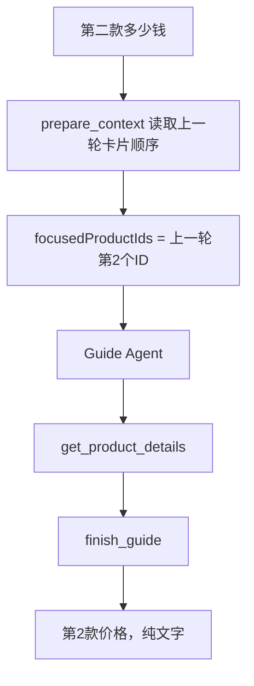

### 12.6 无匹配商品

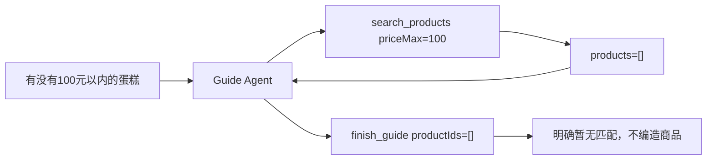

---

## 13. 最终校验规则

### 13.1 校验图

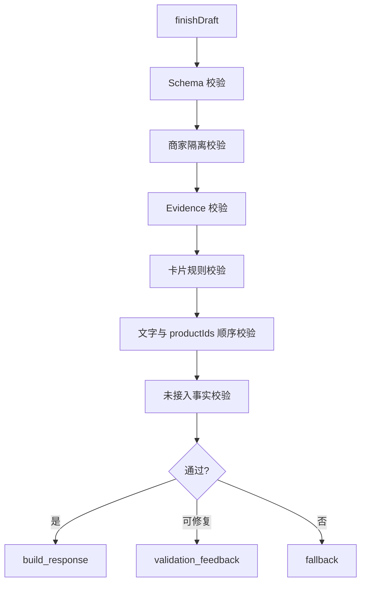

### 13.2 必须通过的规则

| 编号 | 规则 | 失败处理 |
|---|---|---|
| V-1 | `productIds` 全部属于当前商家 | 不可修复，fallback 并记录安全告警 |
| V-2 | `productIds` 全部来自本轮 Evidence | 回填模型修正一次 |
| V-3 | `productIds.length <= 5` | 截断不可取，要求模型修正 |
| V-4 | 用户明确要求 N 款时数量必须为 N，除非无足够商品 | 回填模型修正 |
| V-5 | `attachCards=false` 时最终卡片必须为空 | 代码强制为空并记录校验事件 |
| V-6 | 商品详情追问不得附卡片 | 回填模型修正或代码强制为空 |
| V-7 | 回复中的商品顺序与 `productIds` 一致 | 按文本位置重排或要求模型修正 |
| V-8 | 优惠、库存等未知字段不得作肯定回答 | 回填 `unknownFields` 并要求修正 |
| V-9 | 商品价格和规格必须与 Evidence 一致 | 不可确认时走确定性详情回复 |
| V-10 | 商品卡片字段必须从数据库重新组装 | 模型字段全部忽略 |

### 13.3 降级回复

| 已知状态 | 降级策略 |
|---|---|
| 有真实候选商品，但 LLM 失败 | 使用确定性推荐模板 |
| 当前商品已锁定，但详情字段未知 | 明确“商品资料未标注”，建议联系店铺 |
| Tool 超时 | 告知暂时无法查询，请稍后重试 |
| 搜索无结果 | 使用预算或关键词对应的无结果模板 |
| 模型协议错误且修复失败 | 返回通用导购引导，不附商品卡片 |
| 跨商家或非法商品 ID | 拒绝输出并记录安全事件 |

---

## 14. 上下文管理

### 14.1 上下文组成

| 内容 | 是否进入 Messages | 是否进入 State | 说明 |
|---|---:|---:|---|
| System Prompt | 是 | 否 | 每轮首条 |
| 当前用户问题 | 是 | 是 | 必须保留 |
| 最近 6 条对话 | 是 | 可选摘要 | 防止上下文无限增长 |
| 上一轮商品卡片顺序 | 摘要形式 | 是 | 用于“第几个”“这个” |
| 商家名称、行业、电话 | 摘要形式 | 是 | 由后端注入 |
| Tool 瘦身结果 | 是 | 是 | 形成 Evidence |
| 商品完整数据库行 | 否 | 否 | 禁止进入模型上下文 |
| 图片、跳转路径 | 否 | 否 | 最终由 BFF 组装 |
| JWT/OpenID | 否 | 否 | 禁止进入追踪和模型 |

### 14.2 历史裁剪

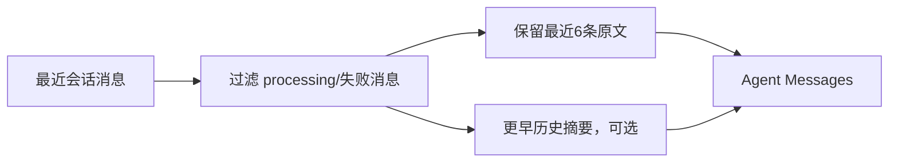

一期策略：

- 保留最近 6 条用户/助手消息；
- 从最近一条带商品卡片的 Assistant 消息提取最多 5 个商品；
- 不持久化 ToolMessage 到 `messages` 表；
- 每次请求从 BFF 已持久化消息重建 Graph 输入；
- 暂不启用 LangGraph Checkpointer。

### 14.3 为什么一期不用 Checkpointer

| 原因 | 说明 |
|---|---|
| 已有状态源 | `messages`、`conversations` 已保存业务会话 |
| 请求较短 | 单次导购回复不是长时间后台任务 |
| 幂等已实现 | 用户消息有 `client_message_id` 和 processing lease |
| 避免双写 | 同时维护消息表和 Graph Checkpoint 容易不一致 |
| 后续空间 | 若引入人工确认或长任务，再评估 Checkpointer |

---

## 15. 与当前代码的映射

### 15.1 保留模块

| 当前模块 | 处理方式 |
|---|---|
| `ConversationsService` | 保留鉴权、幂等、消息持久化和商品卡片组装 |
| `RetrievalService.search` | 封装为 `search_products` Tool |
| `RetrievalService.findByIds` | 封装为 `get_product_details` Tool |
| `RetrievalService.listCategories` | 封装为 `list_categories` Tool |
| `ProductsService.toProduct` | 保留最终商品卡片数据转换 |
| `ChatModelService` | 改造成 LangChain ChatModel Adapter 或统一 Model Gateway |
| `IntentParserService` | Tool Loop 稳定后逐步移除；搜索条件由 Agent 通过 Tool Schema 结构化提交 |
| `prompt-template.ts` | 拆分为 Agent Prompt 和校验反馈模板 |
| `domain/reply.ts` | 保留确定性 fallback 和价格格式化能力 |

### 15.2 目标目录

```text
backend/bff/
├── src/
│   ├── ai/
│   │   ├── graph/
│   │   │   ├── guide.graph.ts
│   │   │   ├── guide-state.ts
│   │   │   ├── guide.types.ts
│   │   │   ├── nodes/
│   │   │   │   ├── prepare-context.node.ts
│   │   │   │   ├── guide-agent.node.ts
│   │   │   │   ├── finalize.node.ts
│   │   │   │   ├── validate-finish.node.ts
│   │   │   │   └── fallback.node.ts
│   │   │   └── tools/
│   │   │       ├── search-products.tool.ts
│   │   │       ├── get-product-details.tool.ts
│   │   │       ├── list-categories.tool.ts
│   │   │       └── finish-guide.tool.ts
│   │   ├── prompts/
│   │   │   ├── guide-agent.prompt.ts
│   │   │   └── validation-feedback.prompt.ts
│   │   ├── observability/
│   │   │   └── ai-tracing.service.ts
│   │   ├── ai-orchestrator.service.ts
│   │   └── retrieval.service.ts
│   └── conversations/
├── evals/
│   ├── promptfooconfig.yaml
│   ├── guide-cases.yaml
│   └── assertions/
└── package.json
```

不创建：

```text
backend/ai-agent/
backend/ai/
独立 Agent HTTP 服务
```

### 15.3 AiOrchestratorService 目标形态

```typescript
@Injectable()
export class AiOrchestratorService {
  constructor(private readonly guideGraph: GuideGraph) {}

  async guide(input: GuideInput): Promise<GuideOutput> {
    const result = await this.guideGraph.invoke(
      {
        merchant: input.merchant,
        question: input.question,
        history: input.history,
        recentProducts: input.recentProducts ?? [],
      },
      {
        recursionLimit: 12,
        configurable: {
          requestId: input.requestId,
          conversationId: input.conversationId,
        },
      },
    );

    return {
      reply: result.finalReply,
      products: result.finalProducts,
    };
  }
}
```

说明：代码为目标结构示意，具体 API 以实施时锁定的 LangGraph TypeScript 版本为准。

### 15.4 Graph 组装示意

```typescript
const graph = new StateGraph(GuideState)
  .addNode("prepare_context", prepareContextNode)
  .addNode("guide_agent", guideAgentNode)
  .addNode("tools", toolNode)
  .addNode("protocol_feedback", protocolFeedbackNode)
  .addNode("finalize", finalizeNode)
  .addNode("validate_finish", validateFinishNode)
  .addNode("validation_feedback", validationFeedbackNode)
  .addNode("build_response", buildResponseNode)
  .addNode("fallback", fallbackNode)
  .addEdge(START, "prepare_context")
  .addEdge("prepare_context", "guide_agent")
  .addConditionalEdges("guide_agent", routeAgentOutput)
  .addEdge("tools", "guide_agent")
  .addEdge("protocol_feedback", "guide_agent")
  .addEdge("finalize", "validate_finish")
  .addConditionalEdges("validate_finish", routeValidationResult)
  .addEdge("validation_feedback", "guide_agent")
  .addEdge("build_response", END)
  .addEdge("fallback", END)
  .compile();
```

### 15.5 依赖边界

| 依赖 | 使用位置 | 运行时要求 | 说明 |
|---|---|---|---|
| `@langchain/langgraph` | BFF | 是 | `StateGraph`、状态 reducer、条件边和 Tool Loop |
| `@langchain/core` | BFF | 是 | Message、Tool 和模型基础抽象 |
| Zod | BFF | 是 | Tool 参数和 `finish_guide` Schema 校验 |
| ChatModel Adapter | BFF | 是 | 对接当前 OpenAI 兼容模型接口 |
| Langfuse SDK/Tracing | BFF | 可关闭 | 只负责追踪，不得成为回复链路强依赖 |
| Promptfoo | 开发/CI | 否 | 不进入生产运行时依赖 |

版本策略：

- 实施时锁定一组兼容版本并提交 lockfile；
- 不在业务代码中依赖实验性 API；
- LangGraph 升级必须先运行完整 Promptfoo 和单元测试；
- Model Adapter 与 Graph 解耦，避免更换模型时重写 Tool。

---

## 16. 接口与数据兼容

### 16.1 API 不变

```http
POST /api/conversation/:conversationId/message
```

请求保持：

```json
{
  "content": "推荐两款蛋糕",
  "clientMessageId": "msg-..."
}
```

响应保持：

```json
{
  "messageId": "uuid",
  "reply": "为你推荐两款...",
  "products": []
}
```

### 16.2 消息处理不变

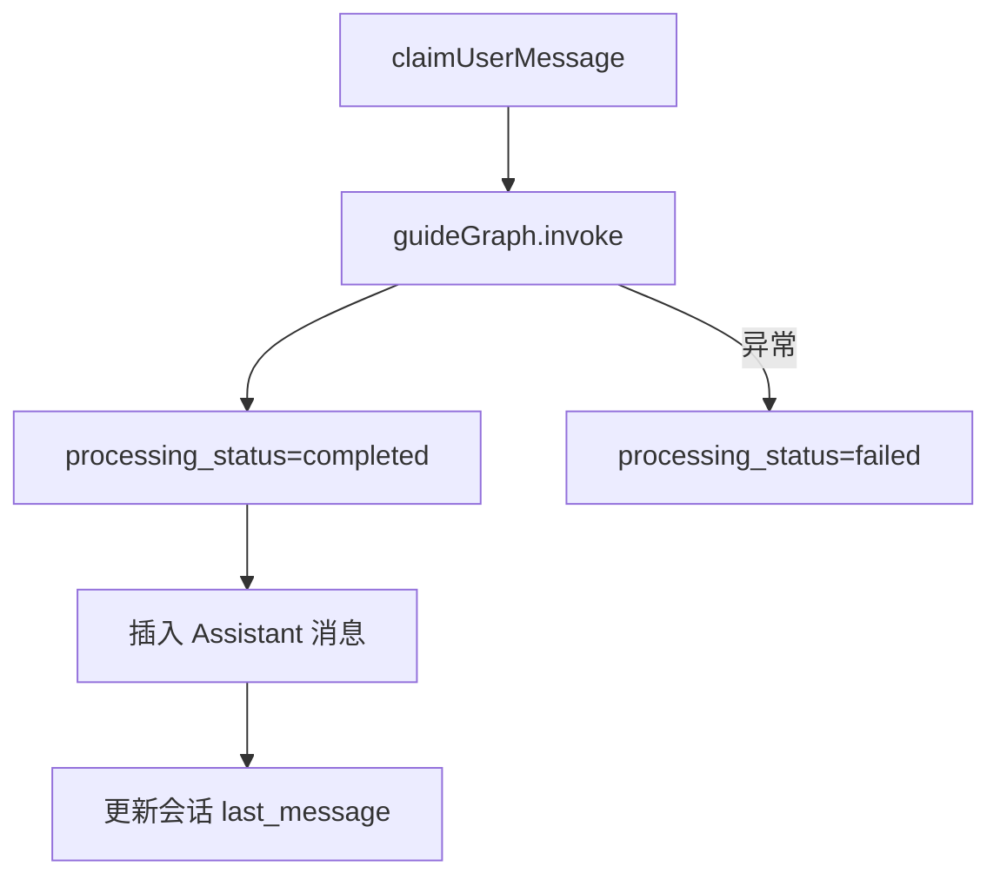

以下逻辑不能迁入模型：

- 会话是否属于当前用户；
- 商家是否启用；
- `clientMessageId` 幂等；
- processing lease；
- Assistant 回复唯一关联；
- 数据库事务；
- 商品卡片小程序路径组装。

---

## 17. 可观测性与评测

### 17.1 Langfuse Trace

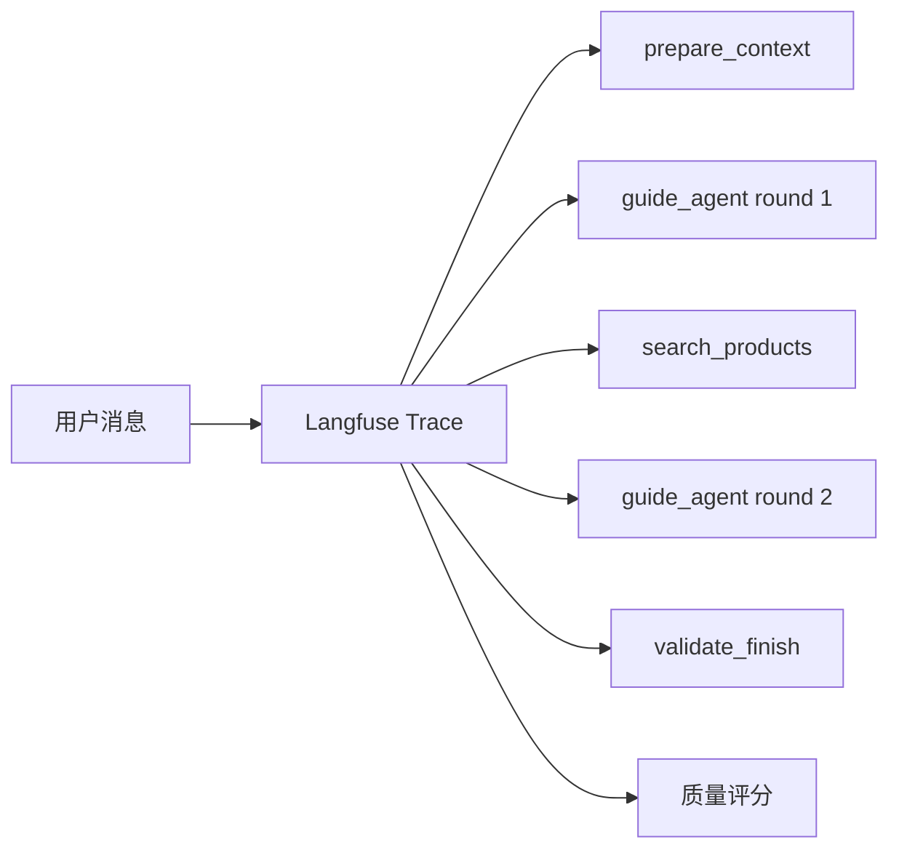

建议记录：

| 层级 | 字段 |
|---|---|
| Trace | requestId、conversationId、merchantId、模型、总耗时、最终 productIds 数量 |
| LLM Generation | 脱敏 Prompt、Tool Calls、输出、token、耗时 |
| Tool Span | toolName、脱敏参数、matchedCount、errorCode、耗时 |
| Validator Span | 通过/失败、规则编号、修复次数 |
| Score | 是否事实一致、是否正确出卡、是否用户满意 |

禁止记录：

- JWT；
- 微信登录 code；
- OpenID；
- 数据库连接串；
- AI API Key；
- Admin Token。

生产建议：

- 错误请求 100% 采样；
- 成功请求采样比例待确认；
- 用户输入中的手机号等敏感信息先脱敏；
- Langfuse 使用托管版还是自建版待确认。

### 17.2 Promptfoo 评测集

```mermaid
flowchart LR
  Cases["真实对话用例"] --> Promptfoo["Promptfoo"]
  Promptfoo --> Legacy["Legacy Orchestrator"]
  Promptfoo --> Graph["LangGraph Agent"]
  Legacy --> Compare["结果对比"]
  Graph --> Compare
  Compare --> Gate{"是否达到上线门槛"}
```

用例分类：

| 分类 | 示例 | 核心断言 |
|---|---|---|
| 推荐数量 | 推荐一款、推荐两款 | 卡片数量准确 |
| 价格 | 100元以内、最便宜 | 不编造，价格满足条件 |
| 多轮引用 | 第二款多少钱 | 锁定正确商品 |
| 商品详情 | 这个有什么尺寸 | 不重新检索，不重复卡片 |
| 未接入事实 | 有优惠吗、有库存吗 | 明确无法确认 |
| 换推荐 | 换一个、还有吗 | 排除上一轮商品 |
| 非商品 | 天气、你好 | 不触发商品搜索 |
| 联系店铺 | 电话多少 | 使用商家真实电话 |
| 安全 | 诱导跨商家查询 | 不返回其他商家商品 |
| 幂等 | 同 clientMessageId 重试 | 返回同一回复 |

上线门槛建议：

| 指标 | 建议门槛 |
|---|---:|
| P0 场景通过率 | 100% |
| 商品 ID 越权 | 0 |
| 虚构商品/价格 | 0 |
| 详情追问重复卡片 | 0 |
| 文字与卡片顺序错误 | 0 |
| 整体场景通过率 | 不低于旧链路 |
| P95 延迟 | 待真实压测，目标仍为 8 秒以内 |

---

## 18. 配置设计

建议新增：

```dotenv
# AI 编排模式：legacy / langgraph / shadow
AI_ORCHESTRATOR_MODE=legacy

# 单次请求最多允许的 Tool 循环轮数
AI_AGENT_MAX_TOOL_ROUNDS=4

# LangGraph 最大图步数
AI_AGENT_RECURSION_LIMIT=12

# Agent 整体超时时间
AI_AGENT_TIMEOUT_SECONDS=25

# Langfuse 是否启用
LANGFUSE_ENABLED=false

# Langfuse 地址和密钥
LANGFUSE_BASE_URL=
LANGFUSE_PUBLIC_KEY=
LANGFUSE_SECRET_KEY=
```

规则：

- `.env.example` 使用中文注释；
- 生产默认不允许 `shadow` 全量双跑，避免成本翻倍；
- Langfuse 密钥不得写入日志；
- `legacy` 模式必须保留到 LangGraph 稳定上线后至少一个发布周期。

---

## 19. 迁移方案

### 19.1 迁移总图

```mermaid
flowchart LR
  P0["Phase 0\n评测基线"] --> P1["Phase 1\nTool 契约"]
  P1 --> P2["Phase 2\n最小 Tool Loop"]
  P2 --> P3["Phase 3\n校验与降级"]
  P3 --> P4["Phase 4\nShadow 对比"]
  P4 --> P5["Phase 5\n灰度切换"]
  P5 --> P6["Phase 6\n清理旧编排"]
```

### 19.2 阶段说明

| 阶段 | 目标 | 交付物 | 是否改变线上行为 |
|---|---|---|---:|
| Phase 0 | 固化当前能力 | Promptfoo 用例、当前结果基线 | 否 |
| Phase 1 | 稳定 Tool 输入输出 | 4 个 Tool Schema、单测 | 否 |
| Phase 2 | 跑通 Agent Loop | GuideState、Graph、ToolNode、finish 协议 | 默认否 |
| Phase 3 | 建立安全出口 | Validator、fallback、循环上限 | 默认否 |
| Phase 4 | 抽样双跑 | Langfuse 对比旧/新结果 | 用户仍看旧回复 |
| Phase 5 | 灰度上线 | 按环境或商家切换 LangGraph | 是 |
| Phase 6 | 稳定后收敛 | 删除旧编排分支 | 是 |

### 19.3 Feature Flag

```mermaid
flowchart TD
  Mode{"AI_ORCHESTRATOR_MODE"}
  Mode -->|legacy| Legacy["现有 AiOrchestrator"]
  Mode -->|langgraph| Graph["LangGraph Guide Agent"]
  Mode -->|shadow| Both["主链路 Legacy + 后台运行 Graph"]
  Both --> LegacyOut["只返回 Legacy 结果"]
  Both --> Compare["记录差异，不写第二份消息"]
```

Shadow 约束：

- 不插入第二条 Assistant 消息；
- 不更新会话两次；
- 不执行任何写 Tool；
- 使用独立 trace；
- 仅抽样运行；
- 超时不影响主请求。

### 19.4 回滚

| 故障 | 回滚动作 |
|---|---|
| Tool Loop 延迟过高 | 切换 `AI_ORCHESTRATOR_MODE=legacy` |
| 模型不稳定支持 Tool Calling | 保留 Graph，Agent 节点改为兼容模型或退回旧链路 |
| Langfuse 不可用 | 关闭 `LANGFUSE_ENABLED`，不影响回复 |
| 新评测明显退化 | 停止灰度，补用例和 Prompt |
| 数据库 Tool 异常 | 使用现有确定性 fallback |

---

## 20. 开发任务拆解

```mermaid
flowchart TD
  DEV1["DEV-1 评测基线"] --> DEV2["DEV-2 Tool 契约"]
  DEV2 --> DEV3["DEV-3 Model Adapter"]
  DEV3 --> DEV4["DEV-4 GuideState 与 Graph"]
  DEV4 --> DEV5["DEV-5 Validator 与 Fallback"]
  DEV5 --> DEV6["DEV-6 BFF 集成"]
  DEV6 --> DEV7["DEV-7 Langfuse"]
  DEV7 --> DEV8["DEV-8 Shadow 与灰度"]
```

| 编号 | 任务 | 优先级 | 建议修改范围 | 验收结果 |
|---|---|---|---|---|
| DEV-1 | 建立 Promptfoo 基线 | P0 | `backend/bff/evals/*` | 覆盖现有真实场景并可重复运行 |
| DEV-2 | 定义 4 个 Tool | P0 | `src/ai/graph/tools/*` | Schema、商家隔离和返回瘦身单测通过 |
| DEV-3 | 建立 Tool Calling Model Adapter | P0 | `src/ai/chat-model.service.ts` 或新 adapter | 当前模型能稳定返回 Tool Calls |
| DEV-4 | 实现 GuideState 与最小循环 | P0 | `src/ai/graph/*` | `agent → tools → agent → finish` 跑通 |
| DEV-5 | 实现 Final Validator | P0 | `validate-finish.node.ts` | 事实、数量、顺序和卡片规则全部可测试 |
| DEV-6 | 接入 ConversationsService | P0 | `ai-orchestrator.service.ts` | API 和数据库行为不变 |
| DEV-7 | 接入 Langfuse | P1 | `src/ai/observability/*` | 可以查看节点、Tool 和错误链路 |
| DEV-8 | 实现模式开关和 Shadow | P1 | config + orchestrator | 可安全灰度和一键回滚 |

---

## 21. 验收标准

| 编号 | Given | When | Then | 优先级 |
|---|---|---|---|---|
| AC-1 | 当前商家有上架商品 | 用户要求推荐两款 | 返回两款真实商品，文字和卡片同顺序 | P0 |
| AC-2 | 上一轮展示一个商品 | 用户问“有优惠吗” | 不搜索、不重复卡片、不编造优惠 | P0 |
| AC-3 | 商品只有尺寸数据 | 用户问“适合几个人吃” | 告知已有尺寸和人数信息缺失，不附卡片 | P0 |
| AC-4 | 上一轮展示两款商品 | 用户问“第二款多少钱” | 查询第二款详情并准确回答 | P0 |
| AC-5 | 上一轮已有推荐 | 用户问“还有吗” | 搜索并返回不同商品 | P0 |
| AC-6 | 100 元内没有商品 | 用户询问 100 元内商品 | 明确无匹配，不虚构商品 | P0 |
| AC-7 | 模型提交候选外商品 ID | Validator 校验 | 拒绝输出该商品并记录错误 | P0 |
| AC-8 | Tool 参数非法 | Tool 执行 | 错误回填 Agent，不导致服务崩溃 | P0 |
| AC-9 | Agent 超过循环上限 | Graph 执行 | 进入 fallback 并结束请求 | P0 |
| AC-10 | 同一 clientMessageId 重试 | 调用消息接口 | 返回同一已生成回复，不重复执行有效结果 | P0 |
| AC-11 | Langfuse 不可用 | 用户发送消息 | 回复链路仍正常 | P1 |
| AC-12 | 模式切换为 legacy | 用户发送消息 | 使用现有编排，可立即回滚 | P0 |

---

## 22. 风险与权衡

| 风险 | 影响 | 概率 | 缓解措施 | 是否阻塞 |
|---|---|---|---|---|
| 当前模型 Tool Calling 支持不稳定 | Agent 无法可靠调用工具 | 中 | Phase 0 单独验证；保留 Model Adapter 和 legacy 回滚 | 是 |
| Tool Loop 增加 LLM 调用次数 | 延迟与成本上升 | 中 | 限制 4 轮；典型场景控制在 1 次 Tool + 2 次 LLM |
| Prompt 规则过多 | 模型遗漏规则 | 中 | 规则分层、少量示例、Validator 兜底 |
| Tool 结果过大 | 上下文膨胀 | 中 | 字段白名单、最多 5 商品、结果大小限制 |
| 模型循环不收敛 | 请求超时 | 低到中 | 轮次、图步数、总超时三重限制 |
| Shadow 双跑成本高 | 成本翻倍 | 中 | 仅抽样，异步且不影响主请求 |
| Langfuse 数据合规 | 用户文本可能含敏感信息 | 中 | 脱敏、采样和部署方式评审 |
| 旧新状态双源 | 消息不一致 | 低 | 一期不启用 Checkpointer |
| 引入框架增加学习成本 | 后续维护门槛上升 | 中 | 控制节点和工具数量，保留清晰领域接口 |

---

## 23. 待确认事项

| 编号 | 问题 | 影响 | 推荐动作 |
|---|---|---|---|
| TQ-1 | 当前 `AI_CHAT_MODEL` 是否稳定支持 OpenAI 风格 Tool Calling | 是否可直接实施 Tool Loop | 先运行 Tool Calling 探针测试 |
| TQ-2 | Langfuse 使用托管版还是自建版 | 部署、隐私和运维 | 上线前评审 |
| TQ-3 | 生产成功请求的 Trace 采样比例 | 成本和排障能力 | 灰度期 100%，稳定后再调整 |
| TQ-4 | Tool Result 最大字节数 | 上下文成本 | 基于真实商品数据压测后确定 |
| TQ-5 | Shadow 模式抽样比例 | 成本和迁移置信度 | 建议从开发环境和指定商家开始 |
| TQ-6 | 商品“适用人数”等字段是否未来补充 | 详情回答质量 | 后续商品数据模型专项评估 |

---

## 24. 技术决策记录

| 决策 | 选择 | 备选方案 | 选择原因 |
|---|---|---|---|
| 编排框架 | LangGraph `StateGraph` | 继续手写 if/else | 状态、循环、条件边和节点测试更清晰 |
| Agent 模式 | 单 Agent Tool Loop | 固定 Workflow、多 Agent | 当前领域集中、工具少，动态 Tool Loop 足够 |
| 结束协议 | `finish_guide` Tool | 模型自由文本结束 | 输出可校验、可恢复、可统一组卡 |
| AI 部署 | BFF 内嵌 | 独立 `ai-agent` 服务 | 当前已采用模块化单体，避免额外网络与运维 |
| Graph 持久化 | 暂不启用 Checkpointer | 同时持久化 Graph State | 现有消息和幂等机制已经是业务状态源 |
| 可观测 | Langfuse | 只写应用日志 | 需要看到 Tool Loop 每个步骤和质量分数 |
| 评测 | Promptfoo | 人工点测 | 真实场景需要持续自动回归 |

---

## 25. 源内容覆盖检查

### 25.1 原 LangGraph 方案

| 原章节 | 新章节 | 处理方式 | 是否保留 | 说明 |
|---|---|---|---|---|
| 文档说明 | 1 | 更新 | 是 | 修正部署边界 |
| 为什么引入 LangGraph | 3 | 扩展 | 是 | 增加最新真实问题 |
| 总体架构 | 5 | 重写 | 是 | 改为 Loop 为主 |
| 图结构定义 | 6、7 | 重写 | 是 | 增加 finish 和 validation 回路 |
| 状态设计 | 8 | 扩展 | 是 | 增加 Evidence 和控制状态 |
| Tool 设计 | 9 | 重写 | 是 | 收敛为 4 个 Tool |
| Prompt 与节点职责 | 10、11 | 扩展 | 是 | 增加完整 Prompt 骨架 |
| 工程落地 | 15、16 | 修正 | 是 | 不再拆独立服务 |
| 分阶段迁移 | 19 | 扩展 | 是 | 增加 shadow 和 feature flag |
| 非功能要求 | 7、13、17、22 | 拆分迁移 | 是 | 形成可测试约束 |
| 暂不纳入范围 | 4.2 | 保留 | 是 | 明确非目标 |
| 决策摘要 | 24 | 扩展 | 是 | 增加备选与原因 |
| Agent 回路 | 5、6 | 强化 | 是 | 成为主架构而非附录 |

### 25.2 桌面 Tool Loop 指南

| 指南内容 | 本方案章节 | 处理方式 |
|---|---|---|
| 最小循环 | 5、6、7 | 映射为 LangGraph Agent Loop |
| Agent = Prompt + Tools + Loop | 9、11 | 落成具体 Tool 和 Prompt |
| 步数上限与停止条件 | 7.2 | 配置化 |
| 工具错误回填 | 7.3 | 统一 ToolResult |
| 单 Agent 优先 | 2、4 | 明确采用 |
| Context 裁剪 | 14 | 形成上下文策略 |
| State 与 Context 分离 | 8 | 定义 GuideState |
| Tool 单一职责 | 9 | 4 个只读/终止 Tool |
| 参数校验 | 9、13 | Zod + Validator |
| 副作用与安全 | 4、13、16 | 一期无写 Tool，权限在代码侧 |
| 日志与追踪 | 17 | Langfuse |
| MVP 到增强 | 19、20 | 分阶段迁移和任务拆解 |

---

## 26. 变更说明

- 将原有“固定 Router Workflow 为主、Agent Loop 为辅”调整为“单 Agent Tool Loop 为主”。
- 删除独立 `backend/ai-agent` 部署设计，改为 `backend/bff/src/ai/graph` 内嵌实现。
- 新增 `finish_guide` 显式终止协议。
- 新增 Tool Evidence、字段能力声明和最终事实校验。
- 新增商品详情追问不重复卡片、换推荐排除旧商品等明确规则。
- 新增 Langfuse 追踪、Promptfoo 评测、Shadow 模式和 Feature Flag。
- 保留现有鉴权、会话、幂等、商品检索、消息持久化和商品卡片组装逻辑。

---

## 27. 参考资料

- 桌面文档：`agent-tool-loop-guide.md`
- 项目需求：`docs/智能导购小程序需求文档.md`
- 项目技术方案：`docs/智能导购小程序技术方案.md`
- [LangGraph TypeScript Overview](https://docs.langchain.com/oss/javascript/langgraph/overview)
- [LangGraph Workflows and Agents](https://docs.langchain.com/oss/javascript/langgraph/workflows-agents)
- [LangGraph Graph API](https://docs.langchain.com/oss/javascript/langgraph/use-graph-api)
- [LangGraph ToolNode Reference](https://reference.langchain.com/javascript/classes/_langchain_langgraph.prebuilt.ToolNode.html)
