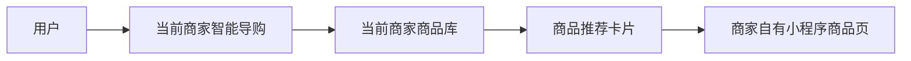
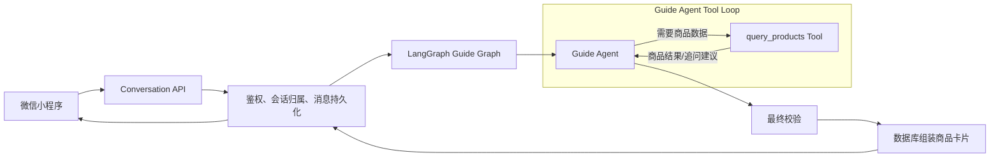
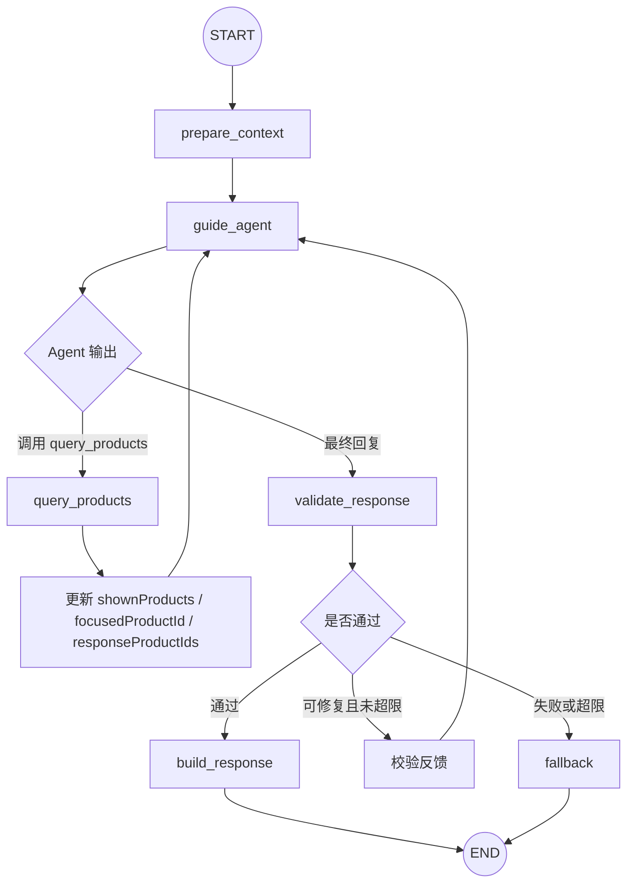
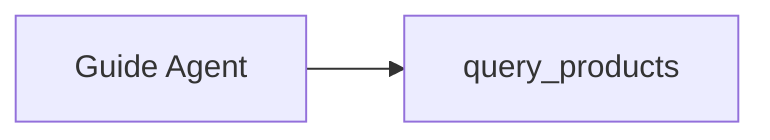
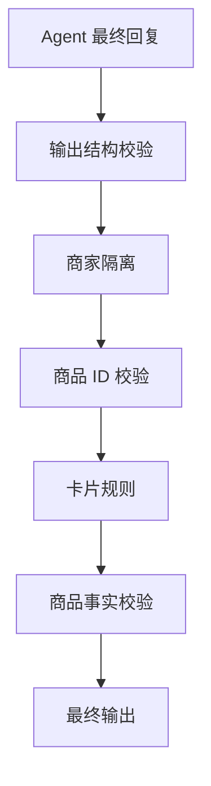
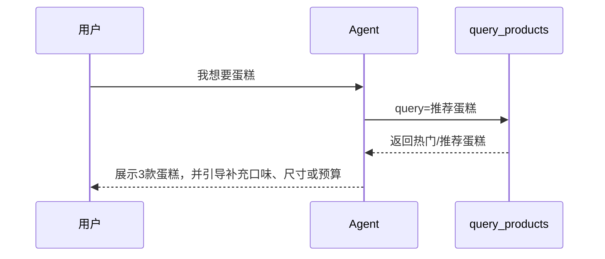
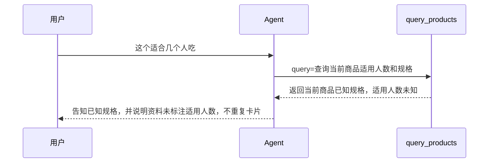
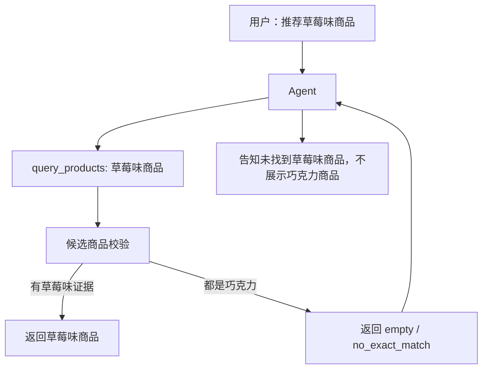
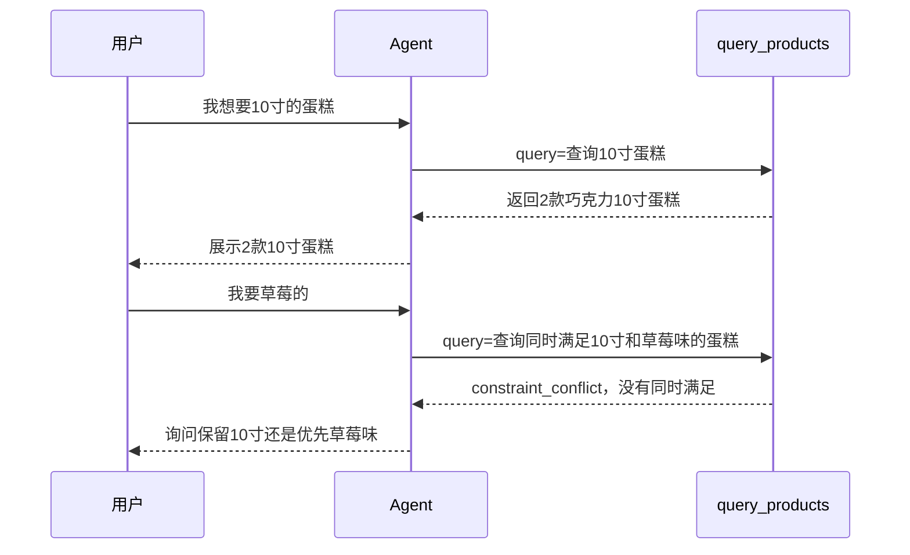

# 智能导购 LangGraph Tool Loop 精简方案

制定日期：2026-07-01

> 本文是当前主方案。此前“四个 Tool + finish_guide”的设计已收敛为“单 Agent + 单 query_products Tool + 极简 State”。详细版 `智能导购LangGraph方案.md` 中与本文冲突的内容，以本文为准。

## 1. 方案结论

当前智能导购的业务边界很清楚：用户在某个商家内咨询商品，系统查询当前商家的真实商品，然后生成回复和商品卡片。

因此目标形态是：

```text
一个 Guide Agent
+ 一个 query_products Tool
+ 一个极简 ProductGuideState
+ 一个确定性 Validator
= 可循环、可校验、不编造的商品咨询 Agent
```

不再拆分 `search_products`、`get_product_details`、`list_categories`、`finish_guide`。

原因：

- 商品推荐、商品详情、品类查询，本质都是查询当前商家的商品数据；
- `get_product_details` 只是按商品 ID 查询，不需要单独成为 Tool；
- `list_categories` 可以作为 `query_products` 内部查询能力；
- 最终答复不需要通过 `finish_guide` Tool 提交，可以由 Agent 输出，代码做最终校验；
- Tool 越少，模型越不容易选错，Prompt 和评测也更简单。

## 2. 当前商品咨询模式

### 2.1 产品定位

当前系统是商家级智能导购入口：



系统负责：

- 查询当前商家的商品；
- 推荐真实、上架商品；
- 回答商品价格、规格和已有描述；
- 展示商品卡片；
- 跳转商家自有小程序商品页；
- 保存会话和消息。

系统不负责：

- 商品详情承载；
- 下单、支付和购物车；
- 配送、售后和退款；
- 实时库存和实时优惠；
- 跨商家推荐。

### 2.2 咨询会话

| 项目 | 当前规则 |
|---|---|
| 商家范围 | 每次咨询只绑定一个商家 |
| 会话复用 | 同一用户再次进入同一商家，30 分钟内复用当前会话 |
| 新会话 | 超过复用时间后创建新会话 |
| 首页展示 | 首页按商家聚合展示用户咨询过的商家 |
| AI 上下文 | 使用当前会话最近消息、最近展示商品和当前焦点商品 |
| 商品指代 | “这个”“第二款”基于当前会话最近商品卡片解析 |
| 跨会话指代 | 新会话不继承上一会话中的“这个”“第二款” |

### 2.3 咨询类型

| 咨询类型 | 示例 | 预期行为 | 是否返回卡片 |
|---|---|---|---:|
| 商品推荐 | 推荐两款生日蛋糕 | 调用 `query_products` 查询商品 | 是 |
| 模糊商品需求 | 我想要蛋糕 | 先查热门/推荐蛋糕，再引导补充条件 | 是 |
| 价格筛选 | 200 元以内有什么 | 查询满足价格条件的商品 | 是 |
| 排序推荐 | 最便宜的蛋糕 | 查询并按价格排序 | 是 |
| 当前商品追问 | 这个多少钱 | 结合 `focusedProductId` 查询当前商品 | 否 |
| 序数商品追问 | 第二款有什么尺寸 | 结合 `shownProducts` 查询第二张卡片商品 | 否 |
| 换商品 | 换一个便宜点的 | 结合上一轮商品重新查询 | 是 |
| 继续推荐 | 还有吗 | 排除已展示商品继续查询 | 是 |
| 品类咨询 | 你们有什么类型 | 查询当前商家商品类别或代表商品 | 可选 |
| 未接入事实 | 有优惠吗、有库存吗 | 没有数据源时明确无法确认 | 否 |
| 闲聊 | 你好、天气不错 | 简短回应并引导商品咨询 | 否 |

## 3. 目标架构

### 3.1 总体结构



### 3.2 主图



### 3.3 职责划分

| 组件 | 负责 |
|---|---|
| ConversationsService | 鉴权、会话归属、消息幂等、消息持久化 |
| LangGraph | Agent 状态、Tool Loop、条件边和终止 |
| Guide Agent | 理解用户意图、判断是否需要查商品、组织回复 |
| `query_products` Tool | 查询当前商家的真实商品，判断商品数据层面的冲突和追问 |
| Validator | 校验商品 ID、商家归属、事实、卡片数量和顺序 |
| ProductsService | 从数据库组装完整商品卡片 |

## 4. Tool 设计

### 4.1 Tool 数量

只保留一个 Tool：



### 4.2 LLM 可见入参

LLM 只需要提供完整查询需求：

```typescript
const QueryProductsToolInput = z.object({
  query: z.string().min(1).describe("完整的商品查询需求，例如：推荐三款200元以内、不太甜的生日蛋糕"),
});
```

示例：

```json
{
  "query": "推荐三款200元以内、不太甜的生日蛋糕"
}
```

### 4.3 运行时注入参数

以下参数不让模型填写，由后端从会话和 State 注入：

```typescript
interface QueryProductsRuntimeContext {
  merchantId: string;
  userId: string;
  shownProducts: ProductSnapshot[];
  focusedProductId?: string;
}
```

原因：

- `merchantId` 不能由模型生成，避免跨商家查询；
- `userId` 来自登录态，不进入 Prompt；
- `shownProducts` 用于解析“第二款”“这些”；
- `focusedProductId` 用于解析“这个”“它”“这款”。

业务方法可以理解为：

```typescript
queryProducts({
  query,
  merchantId,
  shownProducts,
  focusedProductId,
});
```

### 4.4 Tool 返回结构

Tool 不只是返回商品，还要返回查询状态和是否需要追问。

```typescript
type QueryProductsStatus =
  | "success"
  | "empty"
  | "need_clarification"
  | "constraint_conflict"
  | "unsupported_fact"
  | "error";

interface QueryProductsResult {
  status: QueryProductsStatus;
  products: ProductCard[];
  reason?: string;
  clarification?: {
    question: string;
    options?: Array<{
      label: string;
      query: string;
    }>;
  };
  matchedConstraints?: string[];
  rejectedReasons?: string[];
}
```

示例：10 寸和草莓味冲突。

```json
{
  "status": "constraint_conflict",
  "products": [],
  "reason": "没有同时满足10寸和草莓味的蛋糕",
  "clarification": {
    "question": "你更希望保留10寸，还是优先草莓味？",
    "options": [
      {
        "label": "保留10寸",
        "query": "10寸蛋糕"
      },
      {
        "label": "草莓味优先",
        "query": "草莓味蛋糕"
      }
    ]
  }
}
```

### 4.5 Tool 内部检索策略

是否使用向量搜索不交给 Agent 决定，由 Tool 内部自动选择。

| 场景 | 检索策略 |
|---|---|
| 当前商品追问 | 使用 `focusedProductId` 或 `shownProducts` 精确查商品 |
| 明确商品名 | 标题关键词、相似度、SQL 条件优先 |
| 明确价格、尺寸、口味 | SQL / 结构化过滤优先 |
| 场景化需求 | 关键词 + 向量混合召回 |
| 关键词无结果 | 向量兜底 |
| 结果包含硬条件不匹配商品 | Tool 内部剔除或返回冲突 |

向量搜索只负责召回候选商品，不能决定最终是否满足硬条件。

## 5. State 设计

### 5.1 最终 State

State 保持极简，只维护商品列表、当前商品和循环控制。

```typescript
interface ProductGuideState {
  messages: BaseMessage[];
  shownProducts: ProductSnapshot[];
  focusedProductId?: string;
  responseProductIds: string[];
  toolRounds: number;
}
```

### 5.2 商品快照

State 里不放完整商品信息，只放轻量快照。

```typescript
interface ProductSnapshot {
  id: string;
  title: string;
  priceText?: string;
  imageUrl?: string;
  tags?: string[];
  summary?: string;
}
```

完整商品卡片只用于 API 返回给前端：

```typescript
interface ProductCard {
  id: string;
  title: string;
  imageUrl: string;
  priceMin: number;
  priceMax?: number;
  priceText: string;
  salesCount?: number;
  specs?: Array<{
    name: string;
    price: number;
  }>;
  detailUrl?: string;
}
```

### 5.3 不进入 State 的内容

| 内容 | 原因 |
|---|---|
| `merchantId` | 从运行时会话配置注入 |
| `userId` | 从登录态注入 |
| 完整商品详情 | 可能过期且增加上下文体积 |
| 是否使用向量 | Tool 内部判断 |
| 商品检索规则 | 写在 `query_products` 内部 |
| 系统提示词 | 写在 Agent 配置中 |
| JWT、OpenID、密钥 | 禁止进入模型和 Trace |

## 6. Agent 判断规则

### 6.1 什么时候直接查商品

原则：只要用户表达了商品需求，并且能形成合理查询，就先查商品。

| 用户输入 | 动作 |
|---|---|
| 我想要蛋糕 | 查询推荐蛋糕 |
| 有没有草莓味蛋糕 | 查询草莓味蛋糕 |
| 200以内的蛋糕 | 查询价格条件商品 |
| 适合生日的 | 查询生日场景商品 |
| 我要一个好看的 | 查询外观/推荐相关商品 |
| 随便推荐一下 | 查询店铺推荐/热销商品 |
| 这个适合几个人 | 查询当前商品详情 |
| 第二个多少钱 | 查询第二张卡片商品详情 |

不要因为用户条件不完整就立即追问。

### 6.2 什么时候需要追问

| 场景 | 谁判断 | 示例 | 处理 |
|---|---|---|---|
| 商品条件冲突 | Tool | 10寸草莓蛋糕不存在 | Tool 返回 `constraint_conflict` 和追问选项 |
| 查询结果为空且可放宽 | Tool | 100元以内10寸草莓蛋糕不存在 | 询问保留哪个条件 |
| 商品类别过于模糊 | Agent | 我想买点东西 | 追问想看蛋糕、甜品还是伴手礼 |
| 用户指代不清 | Agent + State | 多张卡片后说“这个” | 追问第几款 |
| 必须用户选择才能继续 | Agent | 这两个哪个更合适，但上下文无“这两个” | 追问具体商品 |

结论：

- 商品数据导致的追问，由 Tool 返回缺什么或冲突什么；
- 对话指代导致的追问，由 Agent 根据 State 判断；
- Agent 负责把追问说自然。

### 6.3 硬条件和软条件

| 类型 | 示例 | 处理 |
|---|---|---|
| 硬条件 | 草莓味、10寸、200元以内、无某种过敏原 | 必须满足，不满足不能推荐 |
| 软条件 | 好看、热门、适合生日、仪式感 | 可按相关性排序 |

如果用户说“推荐草莓味商品”，Tool 召回到巧克力商品时，不能把巧克力商品推荐给用户。正确结果是：

```json
{
  "status": "empty",
  "products": [],
  "reason": "未找到明确标注为草莓味的商品"
}
```

## 7. Tool Loop 规则

### 7.1 循环形态

仍然是 Tool Loop，只是循环很短。

```text
Agent → query_products → Agent → 最终回复
```

可能出现：

- 0 次 Tool：打招呼、感谢，或上下文商品数据足够；
- 1 次 Tool：绝大多数商品搜索、推荐和详情追问；
- 2 次 Tool：第一次无结果，Agent 放宽或改写查询后重试；
- 超过上限：确定性降级回复，不允许无限循环。

建议：

```typescript
const MAX_TOOL_ROUNDS = 2;
```

### 7.2 停止条件

| 条件 | 处理 |
|---|---|
| Agent 给出最终回复且校验通过 | 正常返回 |
| Tool 返回 `success` | Agent 基于商品结果生成最终回复 |
| Tool 返回 `need_clarification` | Agent 追问用户 |
| Tool 返回 `constraint_conflict` | Agent 说明冲突并追问取舍 |
| Tool 返回 `empty` | Agent 告知无匹配，不编造商品 |
| Tool 参数错误 | 错误回填 Agent，允许修正一次 |
| 达到最大 Tool 轮数 | 使用已有结果或降级回复 |
| 模型或 Tool 超时 | 结束循环并降级 |

## 8. 最终校验



最终输出建议使用结构化结果，而不是 `finish_guide` Tool：

```typescript
interface GuideFinalOutput {
  reply: string;
  productIds: string[];
  answerType:
    | "recommendation"
    | "product_detail"
    | "clarification"
    | "no_match"
    | "unsupported_fact"
    | "chitchat";
}
```

校验规则：

| 规则 | 要求 |
|---|---|
| 商家隔离 | 商品必须属于当前商家 |
| 商品状态 | 只能新推荐上架商品 |
| 商品来源 | `productIds` 必须来自 Tool 结果或当前 State |
| 商品数量 | 最多 5 个，明确数量必须遵守 |
| 卡片显示 | 详情追问不能重复商品卡片 |
| 卡片顺序 | 与回复中的商品出现顺序一致 |
| 商品事实 | 价格、规格必须来自数据库 |
| 未知字段 | 优惠、库存等未知时不得肯定回答 |
| 卡片内容 | 从数据库重新组装，忽略模型生成字段 |

## 9. 典型咨询流程

### 9.1 模糊商品需求



### 9.2 当前商品追问



### 9.3 草莓味检索误召回



### 9.4 多轮条件追加



### 9.5 无匹配商品

```text
用户：有没有 100 元以内的10寸草莓蛋糕
Agent：调用 query_products("100元以内10寸草莓蛋糕")
Tool：返回 constraint_conflict 或 empty
Agent：说明没有完全匹配，并询问保留预算、尺寸还是口味
```

## 10. 代码边界

### 10.1 目录

```text
backend/bff/src/ai/
├── graph/
│   ├── guide.graph.ts
│   ├── guide-state.ts
│   ├── nodes/
│   └── tools/
├── prompts/
├── observability/
├── ai-orchestrator.service.ts
└── retrieval.service.ts
```

AI 继续内嵌在 `backend/bff`，不创建独立 AI 服务。

### 10.2 API

现有接口保持不变：

```http
POST /api/conversation/:conversationId/message
```

响应保持：

```typescript
interface MessageReply {
  messageId: string;
  reply: string;
  products: ProductCard[];
}
```

### 10.3 不交给 Agent 的逻辑

- 用户鉴权；
- 会话归属；
- 商家启用状态；
- 消息幂等；
- processing 状态和失败重试；
- 数据库事务；
- 商品卡片图片和跳转参数；
- 商品跨商家校验；
- 是否使用向量搜索；
- 价格、规格、上下架等事实校验。

## 11. 验收标准

| 编号 | 场景 | 预期结果 |
|---|---|---|
| AC-1 | 用户说“我想要蛋糕” | 直接查商品并返回推荐蛋糕，不先追问 |
| AC-2 | 推荐两款商品 | 返回两款真实商品，文字和卡片同顺序 |
| AC-3 | 询问当前商品价格 | 查询当前商品，不重复卡片 |
| AC-4 | 询问当前商品优惠 | 没有优惠数据源时明确无法确认 |
| AC-5 | 询问适用人数但商品未提供 | 不编造人数 |
| AC-6 | 询问第二款 | 正确绑定第二张商品卡片 |
| AC-7 | 询问还有吗 | 排除上一轮商品，返回新卡片 |
| AC-8 | 草莓味召回巧克力商品 | 不推荐巧克力商品，返回无精确匹配 |
| AC-9 | 10寸后追加草莓味但无匹配 | 说明条件冲突，询问保留尺寸还是口味 |
| AC-10 | 商品属于其他商家 | 禁止返回 |
| AC-11 | 模型返回候选外商品 ID | 校验失败并修正或降级 |
| AC-12 | Tool Loop 不收敛 | 最多 2 轮后确定性结束 |
| AC-13 | 同一消息重复请求 | 保持现有幂等结果 |

## 12. 本方案不包含

- 迁移阶段和改造成本；
- 多 Agent；
- LangGraph Checkpointer；
- 实时库存和优惠接入；
- 订单、支付、配送和售后 Tool；
- 前端页面改造；
- 商品数据结构扩展。

## 13. 变更说明

本次根据讨论更新：

- 将 Tool 数量从 4 个收敛为 1 个 `query_products`；
- 移除 `finish_guide` Tool，改为 Agent 结构化最终输出 + Validator 校验；
- 明确 LLM 可见 Tool 入参只有 `query`；
- 明确 `merchantId`、`userId`、`shownProducts`、`focusedProductId` 由运行时注入；
- 将 State 收敛为 `messages`、`shownProducts`、`focusedProductId`、`responseProductIds`、`toolRounds`；
- 明确 State 只保存商品快照，完整商品卡片由 API 返回给前端；
- 新增“先查商品，再必要追问”的规则；
- 新增 Tool 返回 `need_clarification`、`constraint_conflict` 等状态；
- 新增硬条件和软条件规则；
- 新增草莓味误召回、10寸后追加草莓味等多轮示例；
- 明确向量搜索按需使用，不作为每次查询的默认必经路径。

