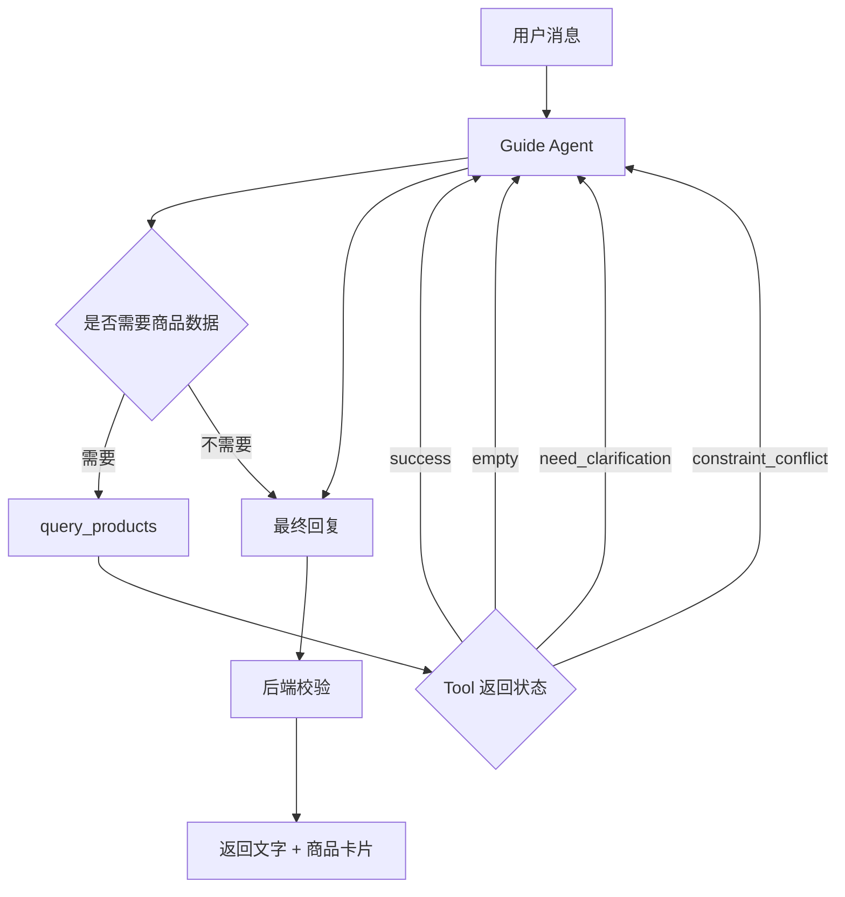
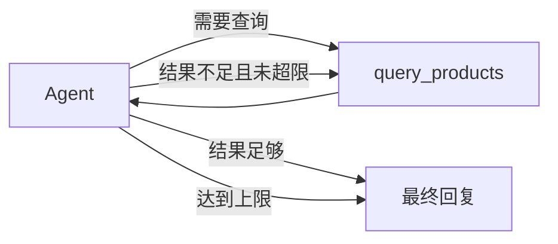
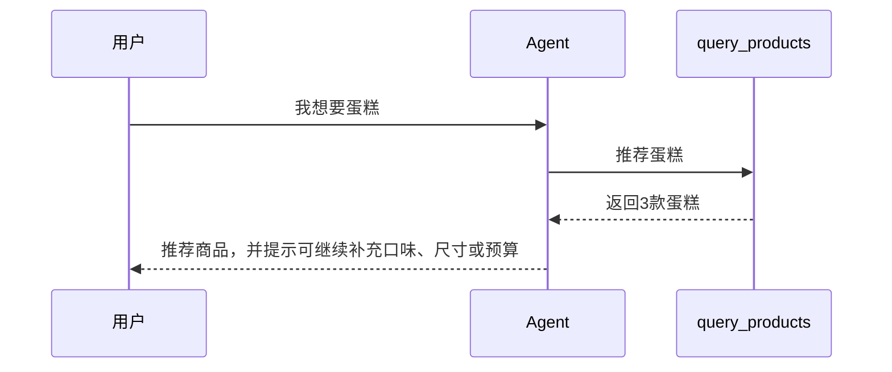
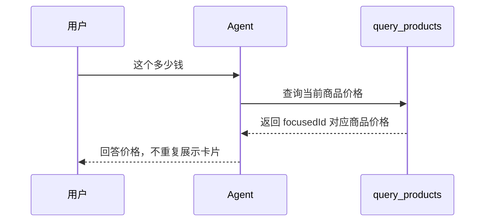
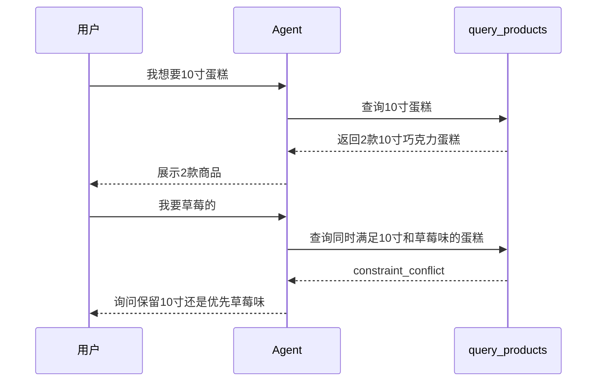
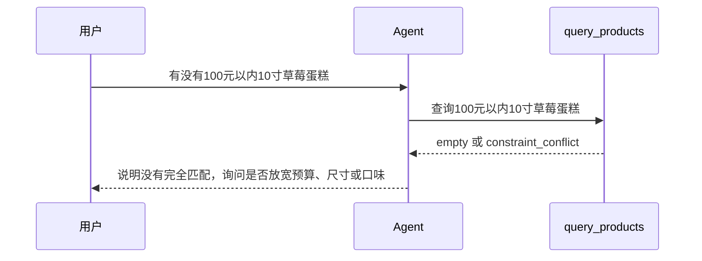

# 智能导购 LangGraph 编排设计

> 只描述 Agent 编排方式，不展开代码实现、迁移成本和产品背景。

## 1. 编排目标

用 LangGraph 把当前商品咨询流程收敛成一个简单可控的 Tool Loop：

```text
用户消息
  → Agent 理解意图和上下文
  → 判断是否需要查商品
  → 必要时调用 query_products
  → Tool 返回商品结果、无结果或追问建议
  → Agent 生成最终回复
  → 后端校验并组装商品卡片
```

核心原则：

- Agent 负责理解、决策和表达；
- Tool 负责查询真实商品数据；
- 代码负责商家隔离、商品校验、卡片组装和安全边界；
- 用户能查就先查，不因为条件不完整就立即追问。

## 2. 总体图



## 3. State

业务 State 只保留三类上下文：

```text
merchantContext
messages
products
```

含义：

| State | 作用 |
|---|---|
| `merchantContext` | 当前商家 ID、名称、行业、电话等 |
| `messages` | 当前会话最近消息，用来理解多轮条件 |
| `products` | 最近展示商品和当前焦点商品 |

`products` 结构：

```text
products.shown      最近展示过的商品列表
products.focusedId  当前正在追问的商品 ID
```

不放入 State：

- 完整商品详情；
- 是否使用向量；
- 检索规则；
- 用户 token；
- 数据库原始行；
- 商品卡片完整渲染数据。

## 4. Tool

只保留一个 Tool：

```text
query_products
```

LLM 可见入参只有：

```json
{
  "query": "完整商品查询需求"
}
```

例如：

```json
{
  "query": "推荐三款200元以内、不太甜的生日蛋糕"
}
```

运行时由系统注入：

```text
merchantId
products.shown
products.focusedId
```

所以 Agent 不需要、也不允许自己填写商家 ID。

## 5. Tool 返回状态

`query_products` 不只是返回商品，也要告诉 Agent 当前结果该怎么处理。

| 状态 | 含义 | Agent 行为 |
|---|---|---|
| `success` | 找到符合条件的商品 | 推荐或回答商品详情 |
| `empty` | 没有匹配商品 | 告知未找到，不编造商品 |
| `need_clarification` | 条件不足或指代不清 | 追问用户 |
| `constraint_conflict` | 条件互相冲突 | 说明冲突并让用户取舍 |
| `unsupported_fact` | 询问库存、优惠等未接入事实 | 明确无法确认 |
| `error` | 查询异常 | 降级回复 |

示例：

```json
{
  "status": "constraint_conflict",
  "products": [],
  "reason": "没有同时满足10寸和草莓味的蛋糕",
  "clarification": {
    "question": "你更希望保留10寸，还是优先草莓味？",
    "options": ["保留10寸", "草莓味优先"]
  }
}
```

## 6. Agent 决策规则

### 6.1 直接查商品

只要能形成合理商品查询，就直接调用 `query_products`。

| 用户输入 | Agent 行为 |
|---|---|
| 我想要蛋糕 | 查询推荐蛋糕 |
| 推荐两款生日蛋糕 | 查询生日蛋糕 |
| 200以内的蛋糕 | 查询价格条件商品 |
| 有没有草莓味蛋糕 | 查询草莓味蛋糕 |
| 随便推荐一下 | 查询店铺推荐或热销商品 |
| 这个多少钱 | 查询当前焦点商品 |
| 第二个有什么尺寸 | 查询最近展示的第二个商品 |

不要一上来追问：

```text
你想要什么口味？
你预算多少？
你要几寸？
```

更好的方式是：

```text
先返回几款商品，再引导用户补充口味、尺寸或预算。
```

### 6.2 需要追问

只有这些情况才追问：

| 场景 | 示例 | 追问原因 |
|---|---|---|
| 商品条件冲突 | 10寸草莓蛋糕不存在 | 必须让用户取舍 |
| 结果为空且可放宽 | 100元以内10寸草莓蛋糕无结果 | 询问保留哪个条件 |
| 商品类别太模糊 | 我想买点东西 | 直接查会太散 |
| 指代不清 | 多张卡片后说“这个” | 无法确定商品 |
| 缺少必要选择 | 这两个哪个好，但上下文没有两个商品 | 无法比较 |

追问来源：

- 商品数据导致的追问，由 Tool 返回；
- 对话指代导致的追问，由 Agent 根据 State 判断。

## 7. Loop 规则

大多数请求只需要一轮：

```text
Agent → query_products → Agent → 回复
```

允许最多两轮 Tool：

```text
第1轮：按用户原始需求查询
第2轮：无结果时放宽或改写查询
结束：回复结果或追问用户
```

不允许无限循环。



## 8. 硬条件与软条件

| 类型 | 示例 | 规则 |
|---|---|---|
| 硬条件 | 草莓味、10寸、200元以内 | 必须满足 |
| 软条件 | 好看、热门、适合生日 | 可按相关性排序 |

如果用户说：

```text
推荐草莓味商品
```

但 Tool 召回的 3 个都是巧克力商品，不能推荐这 3 个。

正确流程：

```text
Tool 校验硬条件
  → 发现没有草莓味证据
  → 返回 empty
  → Agent 告知没有找到草莓味商品
```

## 9. 典型流程

### 9.1 模糊需求



### 9.2 当前商品追问



### 9.3 条件追加



### 9.4 无匹配



## 10. 最终输出

Agent 最终输出：

```json
{
  "reply": "回复文本",
  "productIds": ["商品ID"],
  "answerType": "recommendation"
}
```

后端最终校验：

- `productIds` 必须属于当前商家；
- 商品必须上架；
- 商品必须来自 Tool 结果或当前商品上下文；
- 商品卡片最多 5 个；
- 当前商品追问不重复展示卡片；
- 价格、规格、图片、跳转参数从数据库组装。

## 11. 一句话总结

```text
LangGraph 只负责把“理解用户 → 查询商品 → 根据结果回复”编排成可控循环；
商品事实、商家隔离、硬条件校验和卡片组装都由 Tool 和后端代码保证。
```

